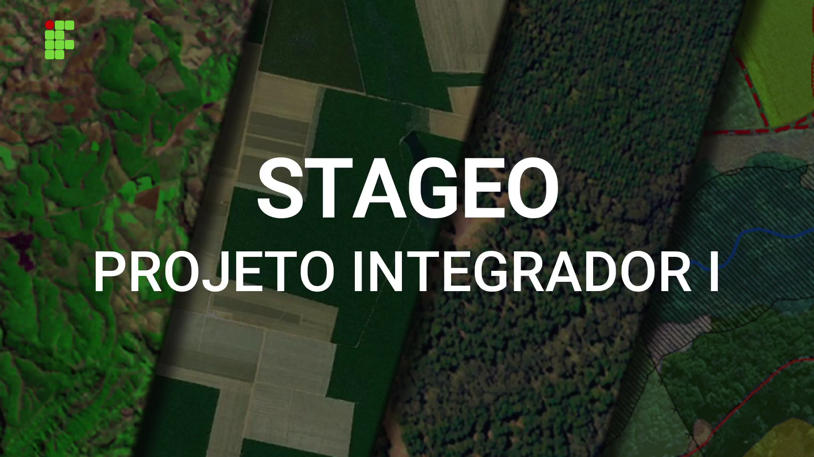

<h1 align="center"> STAGEO </h1>

## 🔘 <a href="https://youtu.be/3IJawkk1tJE" align=center>Clique para conhecer os requisitos</a>

  

### 🤖🤖🤖 Equipe
<ul>
    <li> <a href="https://github.com/cibellemc/">Cibelle Maciel da Costa</a></li>
    <li> <a href="https://github.com/DanielVbrn">Daniel Vitor Barroso Rodrigues Nunes</a></li>
    <li> <a href="https://github.com/marcondesu/">Marcos Vinícius Ferreira de Sousa e Silva</a></li>
</ul>

<h3> 💻 Gerenciador do Projeto: </h3>

Trello

### 📌 Tema Principal

Gerenciamento de estoque

### 🗺️ Área a que se aplica

Automação do processo de controle de disponibilidade de estações no laboratório de Geoprocessamento do Campus Central.

### 📝 Requisitos funcionais
- Registro de empréstimos
- Controle de manutenções 
